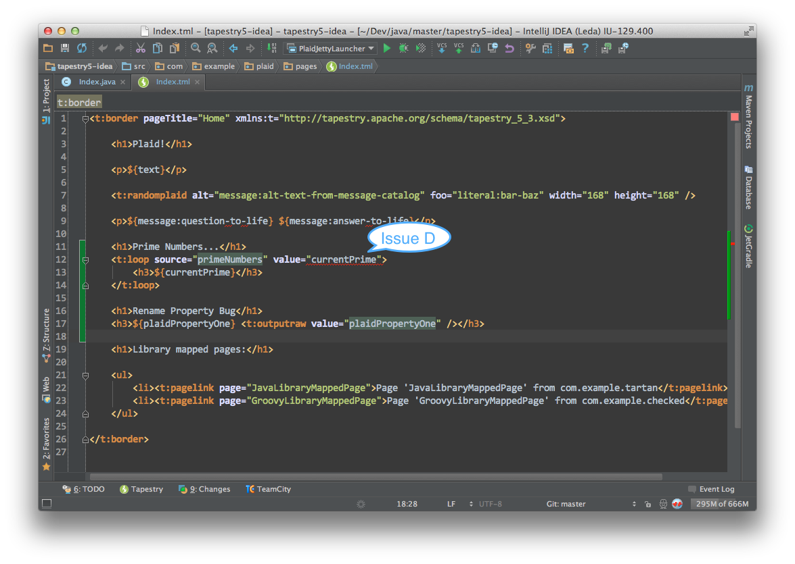
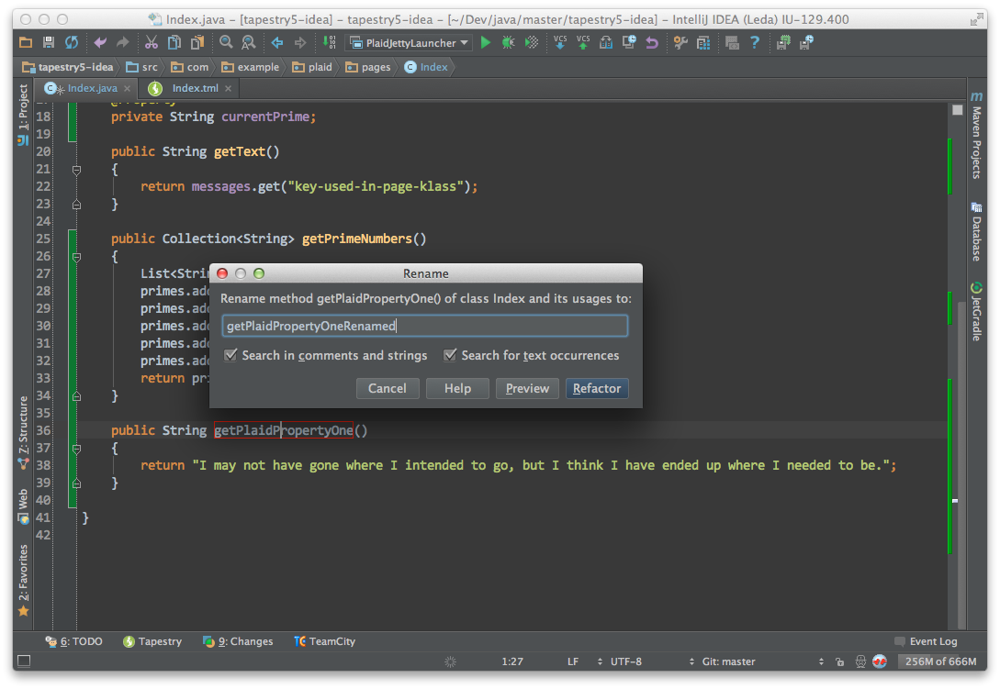
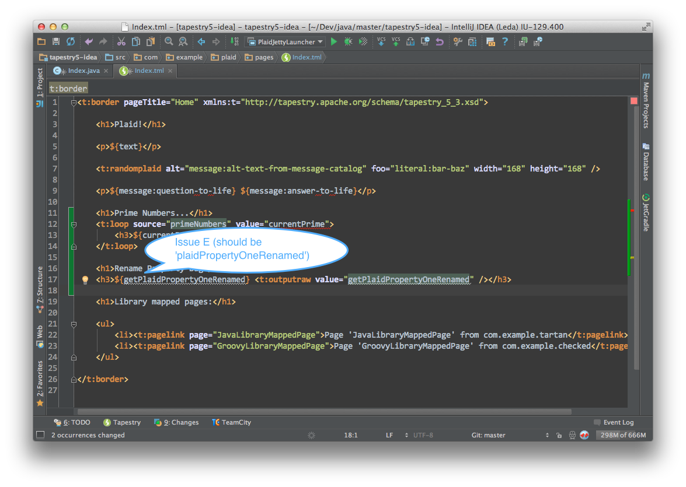

Examples of Validation bugs in IntelliJ IDEA Tapestry 5 Plugin
==============================================================
Current as of IDEA 12.1.3 (EAP IU-129.400)

Issue A
-------

 - Bug: Incorrect red squiggly error line below "-" (dash) characters in TML tag attributes
 - Workaround: None
 - Tracker: [IDEA-100346](http://youtrack.jetbrains.com/issue/IDEA-100346)

Issue B
-------

 - Bug: Properties file editor incorrect highlights keys as 'unused' when referenced in TML file as ${message:property-key}
 - Workaround: Use `messages.get('property-key')` in backing class file
 - Tracker: [IDEA-100796](http://youtrack.jetbrains.com/issue/IDEA-100796)

Issue C
-------

 - Bug: Tapestry 'parameter' namespace elements are incorrectly marked in error in TML editor
 - Workaround: None
 - Tracker: [IDEA-100807](http://youtrack.jetbrains.com/issue/IDEA-100807)

Issue D
-------

 - Bug: Tapestry loop 'value' elements are incorrectly marked as errors in TML editor
 - Workaround: None
 - Tracker: [IDEA-106998](http://youtrack.jetbrains.com/issue/IDEA-106998)

Issue E
-------

 - Bug: Renamed properties in .TML file are modified incorrectly; are prefixed with 'get' (e.g. `${myProp}` is renamed to `${getMyPropRenamed}`
 - Workaround: None
 - Tracker: [IDEA-107000](http://youtrack.jetbrains.com/issue/IDEA-107000)

Resolved Issues
---------------
 - [IDEA-98955](http://youtrack.jetbrains.com/issue/IDEA-98955) __fixed in IDEA 12.0.4 (build >= 123.165)__
 - [IDEA-52763](http://youtrack.jetbrains.com/issue/IDEA-52763) __fixed in IDEA 12.0.3 (build >= 123.155)__
 - [IDEA-24697](http://youtrack.jetbrains.com/issue/IDEA-24697) __fixed in IDEA 12.0.3 (build >= 123.155)__
